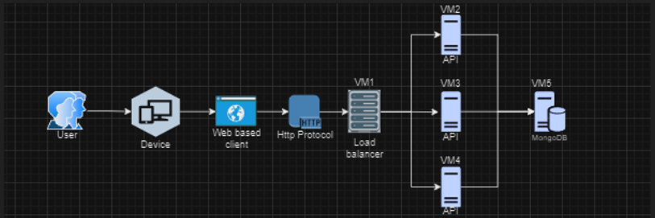
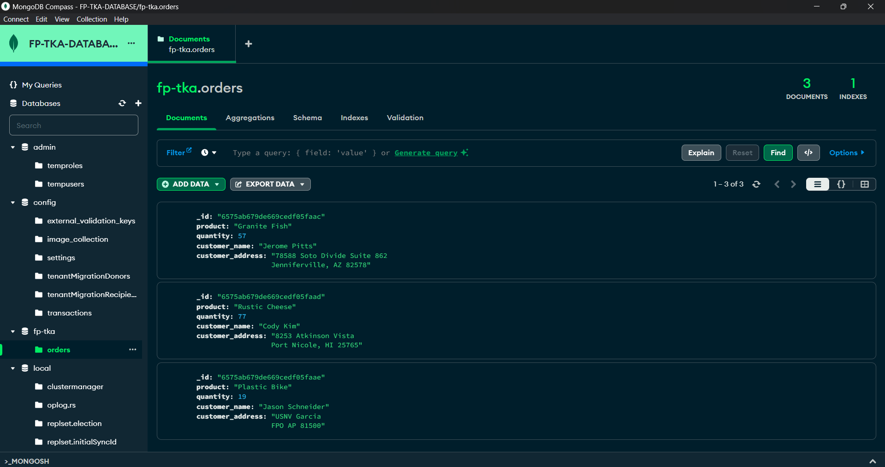
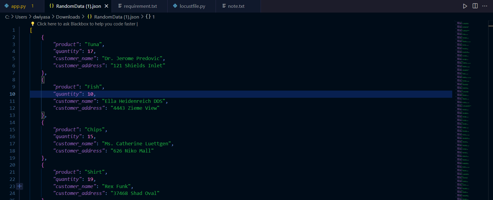
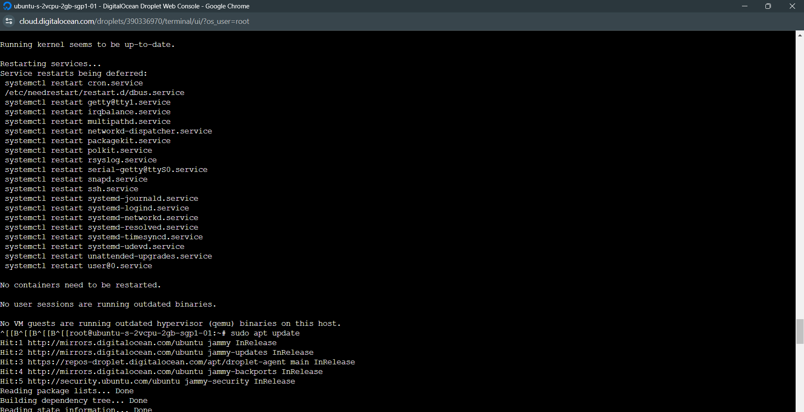
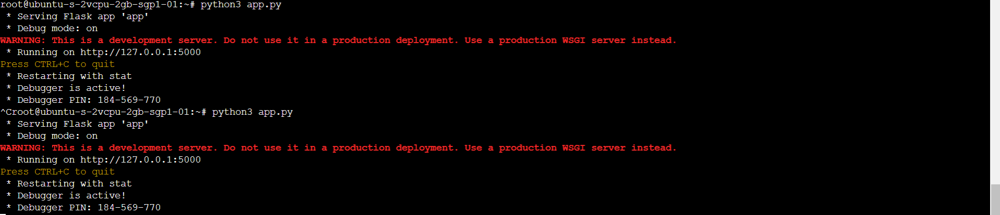
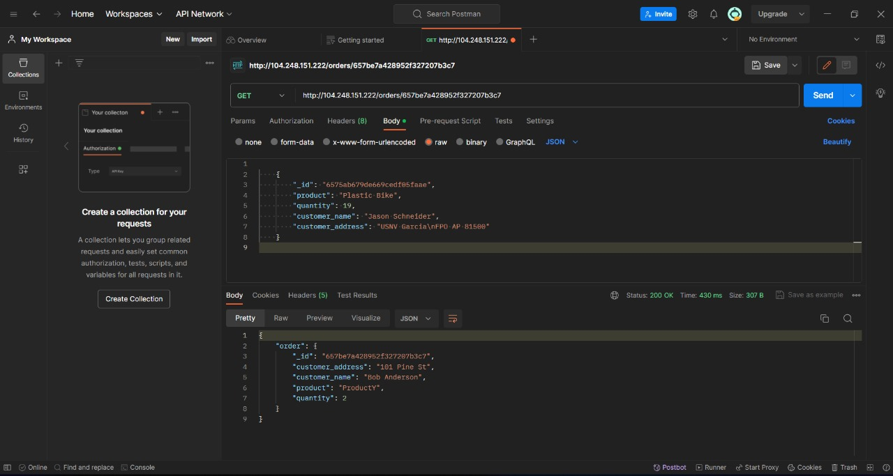
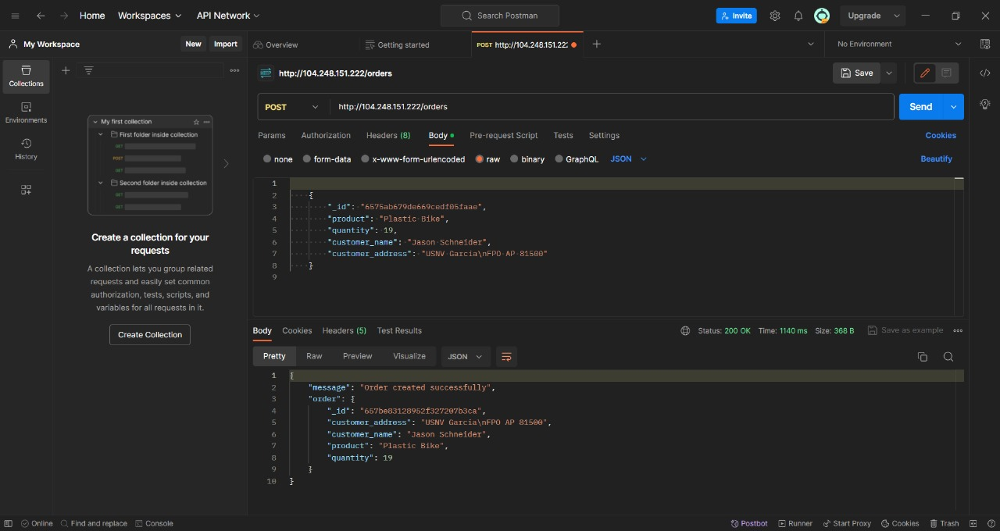
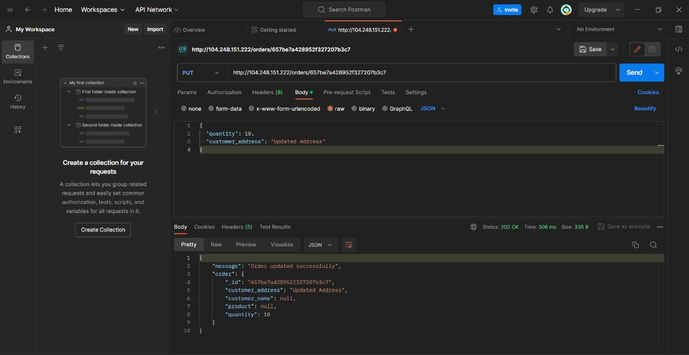
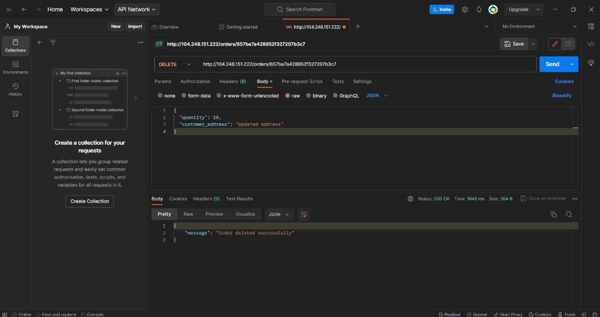
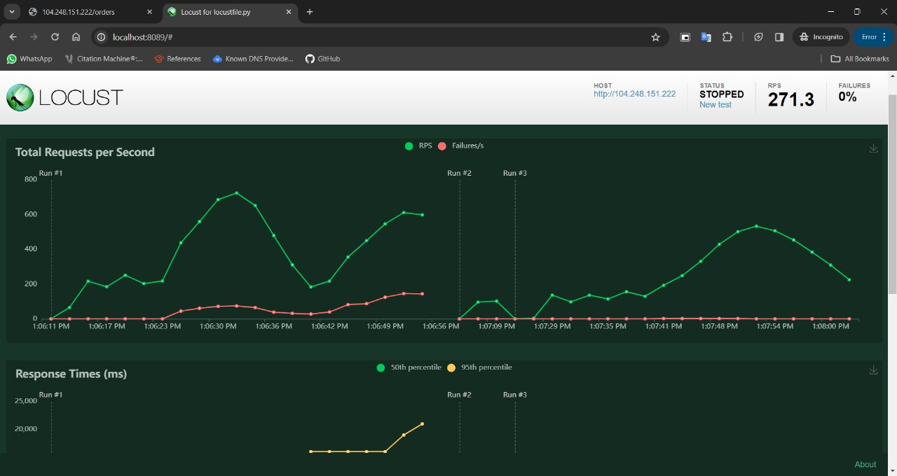

# Final Project
## Teknologi Komputasi Awan (B)

Kelompok 1
| NRP | Nama |
| ------ | ------ |
| 5027221001 | Dwiyasa Nakula |
| 5027221003 | Mohammad Arkananta Radithya Taratugang |
| 5027221004 | Agas Ananta Wijaya |
| 5027221009 | Asadel Naufaleo |

### Permasalahan
Anda adalah seorang lulusan Teknologi Informasi, sebagai ahli IT, salah satu kemampuan yang harus dimiliki adalah Kemampuan merancang, membangun, mengelola aplikasi berbasis komputer menggunakan layanan awan untuk memenuhi kebutuhan organisasi.(menurut kurikulum IT ITS 2023 😙)

Pada suatu saat teman anda ingin mengajak anda memulai bisnis di bidang digital marketing, anda diberikan sebuah aplikasi berbasis API File: [app.py](https://github.com/fuaddary/fp-tka/blob/main/app.py) dengan spesifikasi sebagai berikut.

Kemudian anda diminta untuk mendesain arsitektur cloud yang sesuai dengan kebutuhan aplikasi tersebut. Apabila dana maksimal yang diberikan adalah 1 juta rupiah per bulan (65 US$) konfigurasi cloud terbaik seperti apa yang bisa dibuat?

### Rancangan Arsitektur dan Tabel Harga Spesifikasi VM
Berikut adalah rancangan arsitektur yang telah kami buat untuk final project kami arsitektur

Kami memilih untuk menggunakan Digital Ocean sebagai lingkungan cloud yang akan kami gunakan. Berikut adalah tabel harga spesifikasi VM yang kami buat

### Langkah Implementasi dan Konfigurasi Teknologi
Buat database dan copy connection string

Connect Database dengan MongodbCompass dan isi database tersebut

Buat Droplet VM dan setup

buat app.py lalu run

### Hasil Pengujian Setiap Endpoint
GET ORDERS

GET ORDERS

POST ORDERS

PUT ORDERS

DELETE ORDERS

### Hasil Pengujian dan Analisis Loadtesting Locust

### Kesimpulan dan Saran

Kesimpulan:
Final project sangat sulit

Saran:
Sebaiknya ambil jarkom dulu

